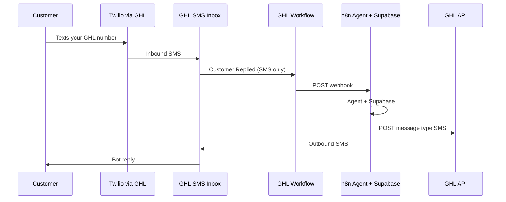

# Volt N' Vent — n8n Bot via GHL (SMS only)

A2P SMS is approved through Twilio in GHL. This guide connects **inbound SMS only** to your n8n agents (Supabase memory). Website chat is unchanged and is **not** handled by this bot.

---

## How it works (SMS only)



**Pattern:** GHL workflow → n8n webhook → GHL API send SMS. No embedding inside GHL’s UI.

---

## Checklist before you start

| Item | Where |
|------|--------|
| GHL **Location ID** | Settings → Business Profile |
| **Private Integration** token | Settings → Private Integrations |
| n8n **production webhook URL** | Webhook node in your agent workflow |
| Supabase credentials | n8n only (never in GHL or the website) |
| A2P number active | GHL → Settings → Phone Numbers |

### Private Integration scopes (minimum)

- `contacts.readonly` (+ `contacts.write` if you tag/handoff)
- `conversations.readonly` / `conversations.write` / `conversations/message.write`
- `locations.readonly`

n8n credential header: `Authorization: Bearer YOUR_TOKEN`

---

## Part 1 — GHL workflow (SMS → n8n)

**Name:** `VNV — n8n SMS Bot`

### Trigger: Customer Replied

1. Automation → Workflows → Create.
2. Trigger: **Customer Replied**.
3. **Channel filter: SMS only** — do not enable Live Chat, Facebook, Instagram, or Email for this workflow.
4. Optional filters:
   - Contact does **not** have tag `human-handoff`
   - Contact does **not** have tag `sms-opt-out` (if you set that on STOP)

### Action 1: Wait (optional)

**Wait** 3–5 seconds — helps when someone sends two texts in a row.

### Action 2: Custom Webhook (POST to n8n)

| Setting | Value |
|---------|--------|
| Method | POST |
| URL | Your n8n production webhook URL |
| Content-Type | application/json |

**Body:**

```json
{
  "location_id": "PASTE_YOUR_LOCATION_ID",
  "contact_id": "{{contact.id}}",
  "conversation_id": "{{conversation.id}}",
  "message_body": "{{message.body}}",
  "message_type": "SMS",
  "phone": "{{contact.phone}}",
  "first_name": "{{contact.first_name}}",
  "last_name": "{{contact.last_name}}"
}
```

### Action 3: End

Do **not** add a “Send SMS” step after the webhook in the same workflow — n8n sends the reply. Two outbound paths = duplicate texts.

### Publish

Turn the workflow **ON** and save.

---

## Part 2 — n8n workflow (your bot)

### 1. Webhook trigger

- Method: **POST**
- Copy **Production URL** into the GHL webhook above
- Optional: require header `X-Webhook-Secret` and match it in GHL custom headers

### 2. STOP / HELP first (A2P required)

Before the AI agent, add an **IF** node on `message_body`:

| Condition | Action |
|-----------|--------|
| Body matches `STOP` (case insensitive) | Do **not** run AI. GHL already handles carrier opt-out; optionally tag `sms-opt-out` via API and exit. |
| Body matches `HELP` | Send fixed SMS: opt-out/help line from your `sms-policy.html`, then exit. |
| Otherwise | Continue to agent |

Example HELP reply (adjust to match your registered campaign):

> Volt N' Vent by JNB Services LLC. Reply STOP to opt out. Msg & data rates may apply. Call 702-808-8861 for help.

### 3. Agent + Supabase

Use your existing chain. Recommended keys in Supabase:

- **Primary key:** `contact_id` or normalized `phone`
- Store: last user message, last bot reply, timestamps

### 4. Send SMS reply (HTTP Request)

| Field | Value |
|-------|--------|
| Method | POST |
| URL | `https://services.leadconnectorhq.com/conversations/messages` |
| Authorization | Bearer + Private Integration token |
| Version | `2021-07-28` |
| Content-Type | application/json |

**Body (always SMS for this setup):**

```json
{
  "type": "SMS",
  "contactId": "={{ $json.contact_id }}",
  "message": "={{ $json.agent_reply }}"
}
```

### 5. Slow agent?

If GPT + Supabase takes more than ~5 seconds, return **200** from the webhook immediately (empty or `{ "ok": true }`), then run the agent and call the GHL API on a follow-up path so GHL doesn’t time out the webhook step.

---

## Part 3 — Turn off duplicate SMS replies

| GHL setting | SMS-only recommendation |
|-------------|-------------------------|
| **Conversation AI** auto-reply on SMS | **Off** |
| Other workflows with “Customer Replied” + Send SMS | Disable or exclude contacts already in the n8n workflow |
| Drip / nurture SMS on same trigger | Use filters so they don’t fire on every inbound reply |

Website chat (`assets/chat-widget.js`) is separate — team or GHL defaults can still handle chat; this bot **only** answers SMS.

---

## Part 4 — Human handoff (SMS)

When the customer says “agent”, “person”, “call me”, or the bot should escalate:

1. n8n → GHL API: add tag `human-handoff`
2. Send one SMS: *“Got it — our team will follow up shortly. You can also call 702-808-8861.”*
3. Optional: assign conversation to a user in GHL
4. GHL workflow trigger already excludes `human-handoff` tag

---

## Part 5 — Test (SMS only)

1. n8n: Webhook → **Listen for test event** (or activate workflow).
2. From your phone, text the **GHL/Twilio number** (not the website chat).
3. Confirm:
   - GHL workflow history shows the webhook step succeeded
   - n8n execution received `contact_id`, `message_body`, `phone`
   - Customer receives **one** AI reply in the SMS thread
4. Text **STOP** — confirm no AI reply (and opt-out behaves per campaign).
5. Text **HELP** — confirm fixed help message only.

---

## Troubleshooting (SMS)

| Symptom | Fix |
|---------|-----|
| Workflow never runs | Workflow not published; trigger not limited to SMS; contact has `human-handoff` |
| n8n runs, no SMS back | Wrong `contactId`; missing `Version` header; token missing `conversations/message.write` |
| Two texts to customer | Conversation AI still on, or second workflow also sending SMS |
| n8n never triggered | Webhook URL typo; using test URL while workflow is live (use production URL) |
| SMS not delivered | A2P number not assigned to location; contact opted out |

---

## Quick reference — your two URLs

1. **GHL → n8n:** n8n Webhook **Production** URL (in Custom Webhook action)
2. **n8n → GHL:** `POST https://services.leadconnectorhq.com/conversations/messages` with `type: "SMS"`

---

## Optional next step

Paste your n8n **production webhook URL** (path can be redacted) and confirm **Conversation AI is OFF** for SMS — then the GHL body and n8n field names can be matched to your exact agent output.
